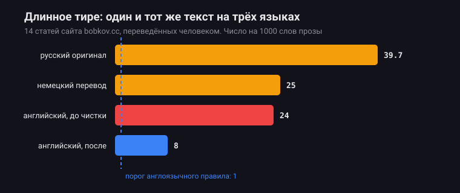
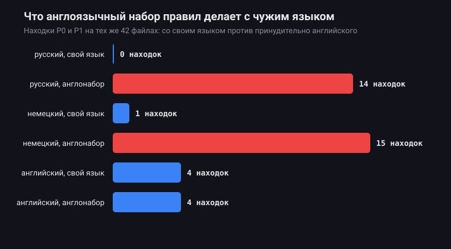

# Замер: что англоязычные правила делают с русским и немецким

Каталоги следов ИИ пишут по-английски и применяют ко всему. Этот замер проверяет, что при этом происходит с текстом на другом языке.

Материал редкий: 14 статей сайта bobkov.cc существуют в трёх версиях — русской, английской и немецкой, переведённых человеком. Сравнивается не разный текст на разных языках, а один и тот же текст.

## Что вышло

**Англоязычный набор правил помечает 28 из 28 русских и немецких статей. Настоящих находок в них ноль.**

| Язык | Файлов | Слов | Находок со своим языком | Тем же набором, но английским |
|---|---|---|---|---|
| Русский | 14 | 12 232 | 0 | 14 |
| Немецкий | 14 | 7 994 | 1 | 15 |
| Английский | 14 | 11 156 | 4 | 4 |

Все 28 лишних находок — одно правило: частота длинного тире. И вот почему оно срабатывает.



| Текст | Тире на 1000 слов |
|---|---|
| Русский оригинал | 39,7 |
| Немецкий перевод | 25,0 |
| Английский перевод до чистки | 24,0 |
| Английский перевод после чистки | 8,0 |
| Порог английского правила | 1 |

Русская проза идёт в сорок раз выше английского порога — и это правильная русская пунктуация: тире между подлежащим и сказуемым обязательно. Правило, применённое к ней, не находит след ИИ. Оно находит русский язык.

## Второе, менее ожидаемое

Английский перевод до чистки шёл на 24,0 — почти вровень с немецким и на пути к русскому. Родная английская редакторская норма ближе к единице.

Переводил человек, и следов машины в словах не было. Перенеслась привычка ставить тире: в русском она норма, в английском выдаёт текст. Калька измерима, и видно её только при сравнении одного текста в двух языках.

После разбора 161 предложения поштучно английская версия опустилась до 8,0, и большая часть остатка — подписи в списках вида `ключ — пояснение`, которые правило и не должно считать.



## Как повторить

```bash
python study/measure.py <каталог с файлами вида имя.ru.md> > study/data.json
python study/chart.py
```

`measure.py` прогоняет `check.js` дважды на каждом файле: с правильным языком и принудительно английским. `chart.py` рисует SVG руками, без зависимостей, как и остальной проект.

Сырые числа лежат рядом: [data.json](data.json), [dashes.json](dashes.json), [english-before.json](english-before.json).

## Что из этого следует для скилла

Языковой слой в plain-prose появился до замера, из общих соображений. Замер показывает цену его отсутствия: инструмент без него на неанглийском тексте выдаёт стопроцентный шум, а инструмент, который всегда неправ, перестают читать.

Отсюда же правило пошире, оно записано в [references/not-tells.md](../references/not-tells.md): помечать нужно привычку, а не символ. Тире, поставленное автором один раз, — пунктуация. Тире в каждом третьем предложении — привычка. Разница не в знаке, а в том, выбирал его человек или нет.

## Границы

Читайте [DATA_NOTE.md](DATA_NOTE.md) прежде, чем ссылаться на числа. Коротко: это один сайт, один автор, 42 файла. Вывод про ложные срабатывания держится не на размере выборки, а на том, что правило про английскую пунктуацию к русской неприменимо по построению. Всё остальное здесь — иллюстрация, а не статистика.
